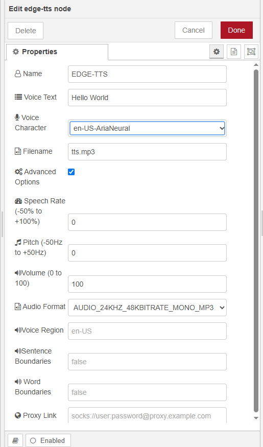
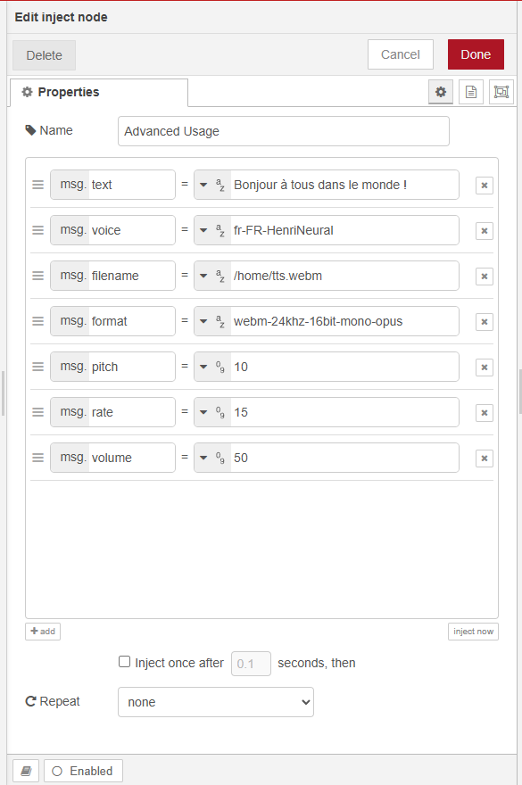

# node-red-contrib-edge-tts

A Node-RED node that converts text to speech using Microsoft Edge's Text-to-Speech service. This node provides a simple way to integrate Azure Speech Service capabilities into your Node-RED flows without requiring an Azure account or API key.

## Overview

This node uses the Microsoft Edge Read Aloud API to generate high-quality speech from text. It supports a wide range of voices across multiple languages and dialects, with customizable speech parameters such as rate, pitch, and volume.


## Changelog

### 2025-04-25 ：

- Update version 3. x
- Not compatible with version 2. x
- Add voice character
- Add new agent
- Other modifications


## Features

- No Azure account or API key required
- 100+ neural voices across multiple languages
- Adjustable speech parameters (rate, pitch, volume)
- Multiple output formats
- Support for SOCKS proxy
- Word and sentence boundary markers (optional)

## Installation

Install via Node-RED's Manage Palette:

```
node-red-contrib-edge-tts
```

Or install via npm:

```bash
npm install node-red-contrib-edge-tts
```

## Requirements

- Node.js >= 16.0.0
- Node-RED >= 3.0.0

## Usage

1. Drag the "MS Edge TTS" node from the TTS category in the palette to your flow
2. Configure the node with your desired voice and other parameters
3. Send a message with text to convert to speech
4. 
5. 
5. example:
```
[
    {
        "id": "78d47d120957febb",
        "type": "edge-tts",
        "z": "f0c558c25f0f876f",
        "name": "EDGE-TTS",
        "voice": "en-US-AriaNeural",
        "text": "Hello World",
        "filename": "tts.mp3",
        "rate": "0",
        "pitch": "0",
        "volume": "100",
        "format": "audio-24khz-48kbitrate-mono-mp3",
        "voiceLocale": "",
        "sentenceBoundary": "",
        "wordBoundary": "",
        "x": 590,
        "y": 280,
        "wires": [
            [
                "a18e1cce694f3a0b"
            ]
        ]
    },
    {
        "id": "07440fc59373f654",
        "type": "inject",
        "z": "f0c558c25f0f876f",
        "name": "basic text to speech",
        "props": [
            {
                "p": "payload"
            }
        ],
        "repeat": "",
        "crontab": "",
        "once": false,
        "onceDelay": 0.1,
        "topic": "",
        "payload": "",
        "payloadType": "date",
        "x": 370,
        "y": 280,
        "wires": [
            [
                "78d47d120957febb"
            ]
        ]
    },
    {
        "id": "a18e1cce694f3a0b",
        "type": "debug",
        "z": "f0c558c25f0f876f",
        "name": "debug 1",
        "active": true,
        "tosidebar": true,
        "console": false,
        "tostatus": false,
        "complete": "true",
        "targetType": "full",
        "statusVal": "",
        "statusType": "auto",
        "x": 800,
        "y": 280,
        "wires": []
    },
    {
        "id": "e562d5502180b41a",
        "type": "edge-tts",
        "z": "f0c558c25f0f876f",
        "name": "EDGE-TTS",
        "voice": "en-US-AriaNeural",
        "text": "",
        "filename": "",
        "rate": "0",
        "pitch": "0",
        "volume": "100",
        "format": "audio-24khz-48kbitrate-mono-mp3",
        "voiceLocale": "",
        "sentenceBoundary": "",
        "wordBoundary": "",
        "x": 590,
        "y": 420,
        "wires": [
            [
                "390baf4035c6e2c2"
            ]
        ]
    },
    {
        "id": "6ab5012df8d88444",
        "type": "inject",
        "z": "f0c558c25f0f876f",
        "name": "Advanced Usage",
        "props": [
            {
                "p": "text",
                "v": "Bonjour à tous dans le monde !",
                "vt": "str"
            },
            {
                "p": "voice",
                "v": "fr-FR-HenriNeural",
                "vt": "str"
            },
            {
                "p": "filename",
                "v": "/home/tts.webm",
                "vt": "str"
            },
            {
                "p": "format",
                "v": "webm-24khz-16bit-mono-opus",
                "vt": "str"
            },
            {
                "p": "pitch",
                "v": "10",
                "vt": "num"
            },
            {
                "p": "rate",
                "v": "15",
                "vt": "num"
            },
            {
                "p": "volume",
                "v": "50",
                "vt": "num"
            }
        ],
        "repeat": "",
        "crontab": "",
        "once": false,
        "onceDelay": 0.1,
        "topic": "",
        "x": 380,
        "y": 420,
        "wires": [
            [
                "e562d5502180b41a"
            ]
        ]
    },
    {
        "id": "390baf4035c6e2c2",
        "type": "debug",
        "z": "f0c558c25f0f876f",
        "name": "debug 2",
        "active": true,
        "tosidebar": true,
        "console": false,
        "tostatus": false,
        "complete": "true",
        "targetType": "full",
        "statusVal": "",
        "statusType": "auto",
        "x": 800,
        "y": 420,
        "wires": []
    }
]
```
### Input

The node accepts the following input properties:

- `msg.payload` (string): Text to convert to speech (if `msg.text` is not provided)
- `msg.text` (string): Text to convert to speech (takes precedence over payload)
- `msg.filename` (string): Path to save the audio file (default: `tts_[timestamp].mp3`)
- `msg.voice` (string): Voice to use for speech synthesis
- `msg.rate` (number): Speech rate adjustment (-100 to 100)
- `msg.pitch` (number): Speech pitch adjustment in Hz
- `msg.volume` (number): Speech volume (0-100)
- `msg.format` (string): Audio output format
- `msg.agent` (string): SOCKS proxy URL (if needed)
- `msg.voiceLocale` (string): Voice locale
- `msg.sentenceBoundary` (boolean): Enable sentence boundary markers
- `msg.wordBoundary` (boolean): Enable word boundary markers

### Output

The node outputs a message with the following properties:

- `msg.result`: Buffer containing the audio data
- `msg.filename`: Path to the saved audio file

## Configuration

### Basic Settings

- **Name**: Custom name for the node (optional)
- **Voice**: Select from 100+ available neural voices
- **Text**: Default text to convert (can be overridden by input message)
- **Filename**: Default path to save the audio file

### Advanced Settings

- **Rate**: Speech rate adjustment (-100 to 100)
- **Pitch**: Speech pitch adjustment in Hz
- **Volume**: Speech volume (0-100)
- **Format**: Audio output format (default: audio-24khz-48kbitrate-mono-mp3)
- **Voice Locale**: Voice locale setting
- **Sentence Boundary**: Enable sentence boundary markers
- **Word Boundary**: Enable word boundary markers
- **Proxy Agent**: SOCKS proxy URL (if needed)

## Example Flow

A simple example flow is included in the examples directory.

## Supported Voices

The node supports a wide range of voices across multiple languages and dialects, including:

- English (US, UK, Australia, etc.)
- Chinese (Mandarin, Cantonese, etc.)
- And many more

## License

Refer to the LICENSE file in the repository.

## Credits

This node is based on the [msedge-tts](https://www.npmjs.com/package/msedge-tts) package.

## Issues and Contributions

Please report any issues or feature requests on the [GitHub repository](https://github.com/iso-lib/node-red-contrib-edge-tts/issues).